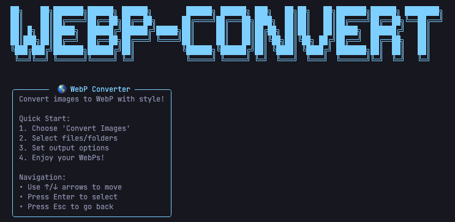
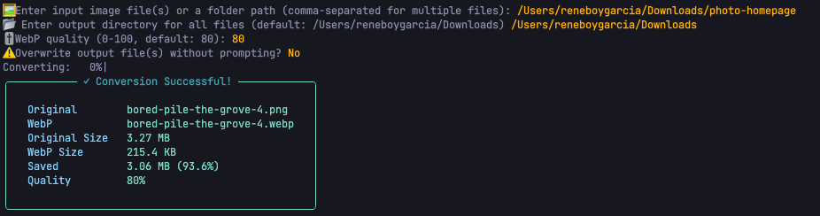

<p align="left">
  
</p>


# WebP Converter CLI

A modern, interactive command-line tool to batch convert images to the WebP format with a beautiful retro/modern terminal UI.

---

## Features

- **Interactive CLI**: Keyboard-navigable menus and prompts using [questionary](https://github.com/tmbo/questionary).
- **Rich Visuals**: Colorful panels, banners, and progress bars powered by [rich](https://github.com/Textualize/rich) and [tqdm](https://github.com/tqdm/tqdm).
- **Batch & Folder Support**: Convert single images or entire folders, recursively.
- **Quality Control**: Set WebP quality interactively.
- **Overwrite Handling**: Smart prompts to avoid accidental overwrites.
- **Friendly Error Reporting**: Clear, styled feedback for errors and successes.
- **Cross-platform**: Works on macOS, Linux, and Windows (Python 3.7+).

---

## Installation

1. **Clone the repository:**
   ```sh
   git clone https://github.com/reneboygarcia/webp-converter.git
   cd webp-converter
   ```
2. **(Recommended) Create a virtual environment:**
   ```sh
   python3 -m venv venv
   source venv/bin/activate  # On Windows: venv\Scripts\activate
   ```
3. **Install dependencies:**
   ```sh
   pip install -r requirements.txt
   ```

---

## Usage

Run the interactive CLI:

```sh
python -m webp_converter.cli
```

Or if installed as a package:

```sh
webp-converter
```

### Main Features
- **Convert Images**: Select files or folders, set output directory and quality, and convert with a progress bar.
- **Show Information**: View project info and usage instructions.
- **Exit**: Quit the application.

---

## Example



---

## Dependencies
- [Pillow](https://python-pillow.org/) (image processing)
- [rich](https://github.com/Textualize/rich) (terminal UI)
- [questionary](https://github.com/tmbo/questionary) (interactive prompts)
- [tqdm](https://github.com/tqdm/tqdm) (progress bars)

Install all dependencies with:
```sh
pip install -r requirements.txt
```

---

## Development
- Code follows clean code principles (SRP, OCP, DRY).
- Main CLI logic is in `webp_converter/cli.py`.
- UI helpers in `webp_converter/ui_helpers.py`.
- Conversion logic in `webp_converter.py` and `cli.py`.
- Contributions welcome! Please open issues or pull requests.

---

## License

MIT License. See [LICENSE](LICENSE) for details.

---

## Author

[Reneboy Garcia](https://github.com/reneboygarcia)
