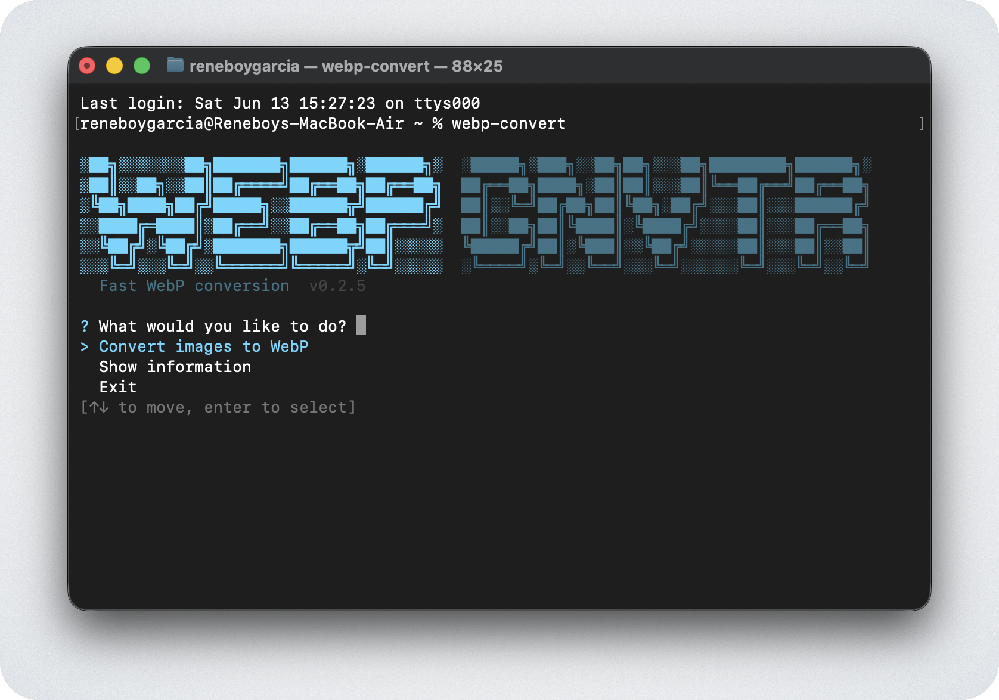
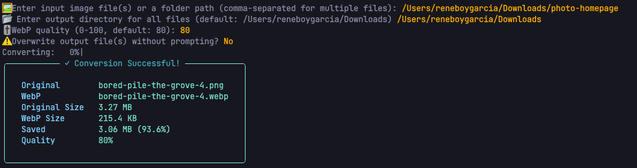

<p align="left">
  
</p>


# WebP Converter CLI

A modern, interactive command-line tool to batch convert images to the WebP format with a beautiful retro/modern terminal UI.

---

## Features

- **Interactive CLI**: Keyboard-navigable menus and prompts using [questionary](https://github.com/tmbo/questionary).
- **Rich Visuals**: Colorful panels, banners, and progress bars powered by [rich](https://github.com/Textualize/rich) and [tqdm](https://github.com/tqdm/tqdm).
- **Batch & Folder Support**: Convert single images or entire folders, recursively.
- **Quality Control**: Set WebP quality interactively.
- **Lossless/Lossy Toggle**: Choose lossless or lossy WebP compression per run.
- **Preserve Structure & WebP Copy**: Recreate input folder structure in the output; existing `.webp` files are copied without re-encoding.
- **Overwrite Handling**: Smart prompts to avoid accidental overwrites.
- **Friendly Error Reporting**: Clear, styled feedback for errors and successes.
- **Cross-platform**: Works on macOS, Linux, and Windows (Python 3.7+).

---

## Installation

### Via Homebrew (macOS / Linux)

Since this utility is hosted on a custom Homebrew Tap, you can install it by running:

```sh
brew install reneboygarcia/homebrew-tap/webp-converter
```

Or you can tap the repository first and install:

```sh
brew tap reneboygarcia/homebrew-tap
brew install webp-converter
```

### Manual Installation (From Source)

1. **Clone the repository:**
   ```sh
   git clone https://github.com/reneboygarcia/webp-converter.git
   cd webp-converter
   ```
2. **(Recommended) Create a virtual environment:**
   ```sh
   python3 -m venv venv
   source venv/bin/activate  # On Windows: venv\Scripts\activate
   ```
3. **Install dependencies:**
   ```sh
   pip install -r requirements.txt
   ```

4. **(Optional) Install the package locally to enable the console command:**
   ```sh
   pip install -e .
   ```

---

## Usage

Run the interactive CLI:

```sh
python -m webp_converter.cli
```

Or if installed as a package:

```sh
webp-convert
```

### Interactive Options

- **Operation Mode**
  - Convert to WebP
  - Resize Only (retain original format)
- **Conversion Settings (Convert to WebP mode)**
  - Quality: 0–100 (default 80)
  - Compression: Lossy or Lossless
- **File Handling**
  - Process single files or folders recursively
  - Preserve input folder structure in the output
  - Existing `.webp` files are copied without re-encoding
  - Overwrite prompts (or choose to overwrite automatically)

### Main Features
- **Convert Images**: Select files or folders, set output directory and quality, and convert with a progress bar.
- **Show Information**: View project info and usage instructions.
- **Exit**: Quit the application.

---

## Example



---

## Dependencies
- [Pillow](https://python-pillow.org/) (image processing)
- [rich](https://github.com/Textualize/rich) (terminal UI)
- [questionary](https://github.com/tmbo/questionary) (interactive prompts)
- [tqdm](https://github.com/tqdm/tqdm) (progress bars)

Install all dependencies with:
```sh
pip install -r requirements.txt
```

---

## Development
- Code follows clean code principles (SRP, OCP, DRY).
- Main CLI logic is in `webp_converter/cli.py`.
- UI helpers in `webp_converter/ui_helpers.py`.
- Shared image utilities in `webp_converter/image_utils.py`.
- Contributions welcome! Please open issues or pull requests.

---

## Author

[Reneboy Garcia](https://github.com/reneboygarcia)
